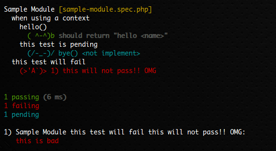

# Peridot PHP Test framework runner for gulp

> Peridot is highly extensible, highly enjoyable, BDD testing framework for PHP. 

## Requirements

* [PHP 5.4 or later](http://php.net/)
* [Peridot](http://peridot-php.github.io/)
* [Leo](http://peridot-php.github.io/leo/) (optional)
* [Xdebug](http://xdebug.org/) (optional)
* [PHP_CodeCoverage](https://github.com/sebastianbergmann/php-code-coverage) (optional)

## Install

```sh
$ npm install --save-dev gulp-peridot
```

## Usage

add it to your `gulpfile.js`:

```js
var peridot = require('gulp-peridot');

gulp.task('peridot', function () {
  return gulp.src('specs')  // <= test specs directory
  .pipe(peridot('/vendor/bin/peridot', {
    filter: 'foo.*.spec.php',
    configurationFile: 'bar-config.php'
    coverageText: true,
    coverageHtml: 'cov-dir',
    coverageBlacklist: [ 'libs', 'bar-config.php' ],
    coverageWhitelist: []
  }));
});
```

## API

### peridot(peridotpath, options)

#### peridotpath

Type: `String`

The path to the desired Peridot executable.

* If not supplied, the defeault path will be `./vendor/bin/peridot` or `$(which peridot)`.

#### options.silent (default: false)

Type: `Boolean`

Do not show report.

#### options.dryRun (default: false)

Type: `Boolean`

Executes dry run (doesn't actually execute tests, just echo command that would be executed).

#### options.configurationFile (default: './peridot.php' (if exists) )

Type: `String`

Define a path to an peridot configuration file (supply full path and filename).

## Code Coverage Options:

> Need Xdebug and PHP_CodeCoverage.

#### options.coverageHtml

Type: `String`

Define a path to HTML code coverage report directory.

#### options.coverageXml

Type: `String`

Define a path to XML code coverage report directory.

#### options.coverageClover

Type: `String`

Define a path to Clover code coverage report file.

#### options.coveragePhp

Type: `String`

Define a path to PHP code coverage report file.

#### options.coverageCrap4j

Type: `String`

Define a path to Crap4j code coverage report file.

#### options.coverageText (default: false)

Type: `Boolean`

Show code coverage report to stdout.

#### options.coverageBlacklist (default: [])

Type: `Array(String)`

Add code coverage blacklist file/directory.

> Local/global composer and gulp-peridot directories are automatically added to blacklist.

#### options.coverageWhitelist (default: [])

Type: `Array(String)`

Add code coverage whitelist file/directory.

## Test Selection Options:

#### options.filter  (default: '\*.spec.php')

Type: `String`

Run tests matching pattern.

## Test Execution Options:

#### options.colors (default: true)

Type: `Boolean`
 
Use colors in output.

#### options.stopOnFailure (default: false)

Type: `Boolean`

Stop execution upon first error or failure.

#### options.reporter (default: 'spec')

Type: `String`

Specify which reporter to use.

## Extra

### 'face' reporter

```js
gulp.task('peridot', function () {
  return gulp.src('specs')
  .pipe(peridot('/vendor/bin/peridot', {
    reporter: 'face'
  }));
});
```



## Changelog

### 0.1.0 (2015-03-26)

* First release (Inspired by [gulp-phpunit](https://www.npmjs.com/package/gulp-phpunit))

## License

[MIT license](http://www.opensource.org/licenses/mit-license)

&copy; 2015 [ktty1220](mailto:ktty1220@gmail.com)
